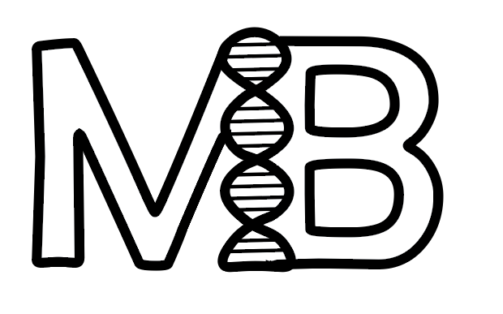

<h1 align="center">M3B</h1>

  

 

    
    
    
    

## 📋 Description
We are Team M3B. We will present our game "Bio Tech" which is composed of two games. The goal of the first game is to complete the replication process. And the purpose of the second is to learn to solve problems with genetics.of two games. The goal of the first game is to complete the replication process. And the purpose of the second is to learn to solve problems with genetics.
## 🚀 Languages 
  
 
  
  

## 🔧 Tools 
  
 
  
  
    
    <a href="https://www.microsoft.com/en-us/microsoft-365/powerpoint">
    <a href="https://www.microsoft.com/en-us/microsoft-365/excel">
     
    
    </a>
  
 
  
## 💼 Documents
- [Documentation](https://codingburgas-my.sharepoint.com/:w:/g/personal/bsbadalova21_codingburgas_bg/EQU7ZIC0bkFBoSBHNlR8NOYBN22KNMWBdQ4KyufAlQKtkg?e=DUJCXN)
- [Presentation](https://codingburgas-my.sharepoint.com/:p:/g/personal/bsbadalova21_codingburgas_bg/EezXTuYLS1VGq69cIaJA1ioBaQai0fKEWdeimTbGqPW5yA?e=KBavYK)
- [QA - Test Plan](https://codingburgas-my.sharepoint.com/:w:/g/personal/bsbadalova21_codingburgas_bg/EdW00GIRG5dBuuaezHHsI3wBn_u_F_OuSXd1AlosLeJvZw?e=hllMKu)
- [QA - Documentation](https://codingburgas-my.sharepoint.com/:x:/g/personal/bsbadalova21_codingburgas_bg/EcNA5UX8zBtKtL-czNmzACcBPpGZab-eJYYpsR5f3kJLcA?e=EKwbme)
## 👨🏻‍💻 Team Members
| **Name** | **Role** | **Grade** |
| :---:   | :---: | :---: |
| Miroslav Ivanov| Back-end developer | 🟨 10A |
| Bilyana Badalova | Scrum Trainer  | 🟥 10B |
| Miroslav Chobanov | Back-end developer  | 🟩 10V |
| Mariela Dimova |  Front-end developer  | 🟦 10G |

